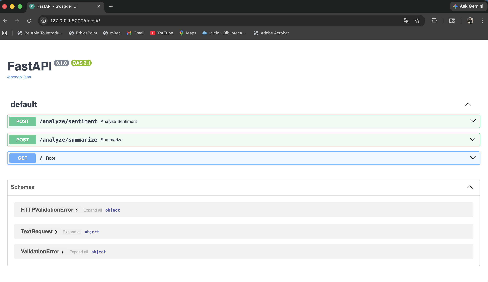
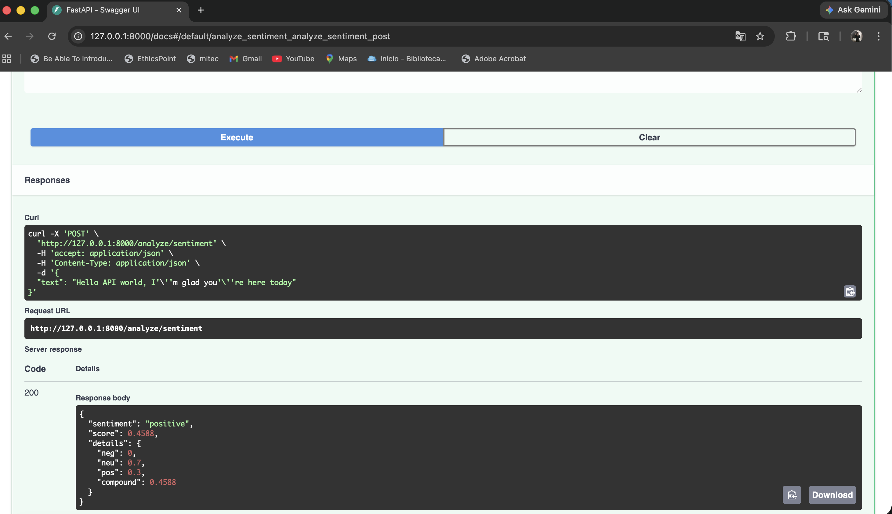

# AI Inference API

A modular backend service built with FastAPI that provides AI-powered text analysis, including sentiment analysis and text summarization using NLP models.

---

## 🚀 Features

* **Sentiment Analysis** using VADER (rule-based NLP)
* **Text Summarization** using transformer models via Hugging Face
* RESTful API with FastAPI and automatic Swagger documentation
* Input validation and schema enforcement using Pydantic
* Modular architecture (routes, services, models) for scalability and maintainability

---

## 🧠 Tech Stack

* Python
* FastAPI
* Hugging Face Transformers
* VADER Sentiment Analysis
* Uvicorn

---

## 📁 Project Structure

```
app/
├── main.py
├── routes/
│   ├── sentiment.py
│   └── summarize.py
├── services/
│   ├── sentiment_service.py
│   └── summarize_service.py
├── models/
│   └── schemas.py
```

---

## ▶️ Getting Started

```bash
git clone https://github.com/yourusername/ai-inference-api.git
cd ai-inference-api

python -m venv venv
source venv/bin/activate

pip install -r requirements.txt

uvicorn app.main:app --reload
```

---

## 📌 API Endpoints

### 🔹 Sentiment Analysis

**POST** `/analyze/sentiment`

```json
{
  "text": "The economy is improving steadily"
}
```

**Response:**

```json
{
  "sentiment": "positive",
  "score": 0.75
}
```

---

### 🔹 Text Summarization

**POST** `/analyze/summarize`

```json
{
  "text": "Long paragraph text here..."
}
```

**Response:**

```json
{
  "summary": "Shortened version of the text"
}
```

---

## 🧪 Demo

Once the server is running, access interactive API docs:

👉 http://127.0.0.1:8000/docs

You can test all endpoints directly from the browser.

---

## ⚙️ Design Decisions

* Separated API routes from business logic to improve maintainability
* Loaded NLP models at service level to optimize performance
* Implemented validation and error handling for robust API behavior

---

## 📸 API Preview

### Swagger UI


### Example Request


---

## 🚧 Future Improvements

* Batch processing endpoint
* Async request handling
* Caching layer for repeated requests
* Docker containerization

---

## 📄 License

MIT License

